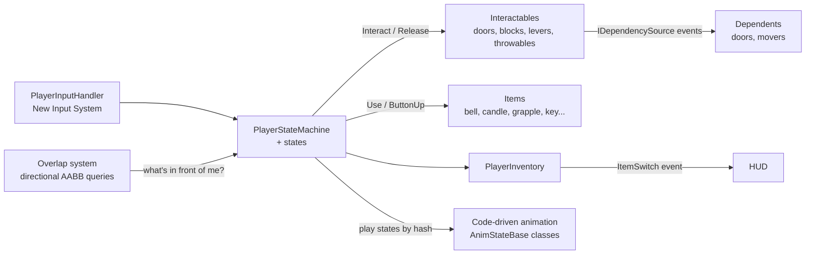
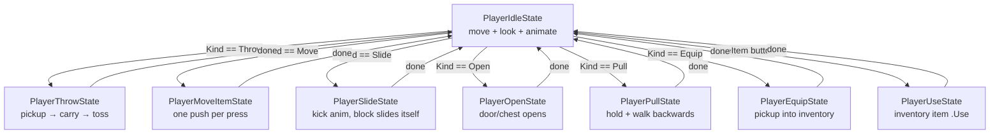
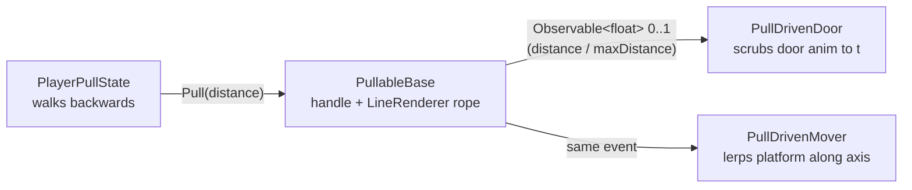
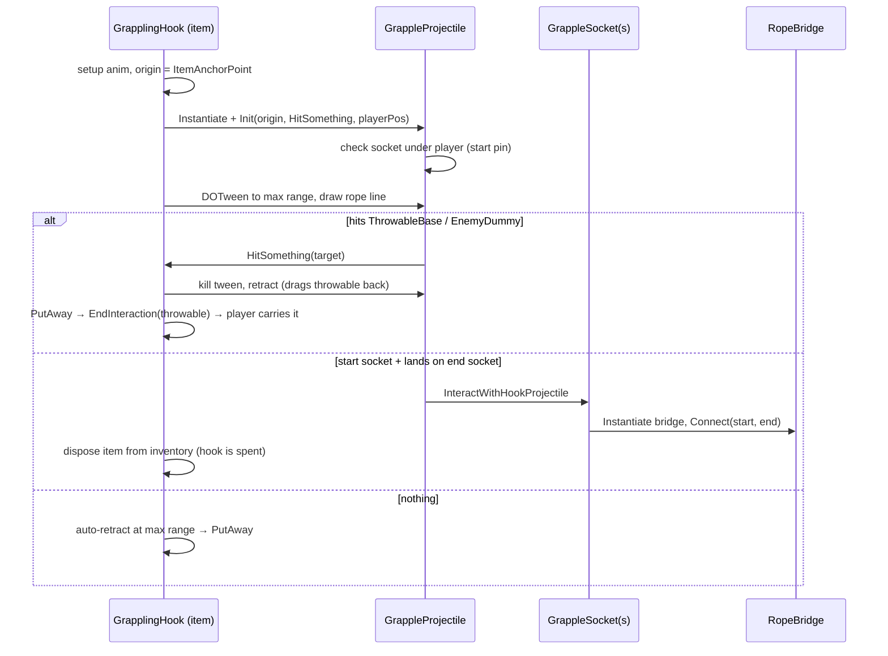

# Interacting Tool — Architecture & Design Document

A top-down 2D Unity game (Zelda-style) built around one core idea: a **player who interacts with the world through objects** — pushing, pulling, sliding, throwing, opening, and equipping things. The codebase is a set of small, composable systems under the `IT.*` namespace in `Assets/Scripts/`.

**Tech stack:** Unity 2D (URP), New Input System, DOTween (tweens), C# async/await (`Task` + Unity `Awaitable`) for timed sequences.

---

## 1. The Big Picture

Everything flows through the **player state machine**. Input drives it, it dispatches to **Interactables** (world objects) or **Items** (inventory objects), and those objects report back through callbacks/events when they're done.



Five design pillars recur everywhere:

1. **State pattern** — the player is always in exactly one `PlayerStateBase`; states own their input handling and animations.
2. **`Interactable` polymorphism** — every world object answers `Kind` (an `InteractionType`), `Interact(context)`, and `Release(context)`. The state machine never knows concrete types.
3. **`IInteractionContext`** — interactables/items never see the player class directly; they get a narrow interface (transform, look direction, inventory, animator, "I'm done" callback).
4. **Observer/dependency system** — puzzle outputs (lever pulled, block seated) publish values via `IDependencySource<T>`; puzzle consumers (doors, platforms) subscribe via `Dependent<T>` / `MultiDependent<T>`. Puzzle pieces never reference each other directly.
5. **Physics layers as game state** — an object's layer (`Interactable`, `Interacting`, `Locked`, `HookSocketUsed`…) encodes what can currently be done to it. `GameUtilities` holds layer names, `LayerIndex` caches the indices.

---

## 2. Folder / Module Map

| Folder | Namespace | Role |
|---|---|---|
| `Core/` | `IT.Core.*` | Shared plumbing: dependency system, `InterfaceRef`, damage interfaces, utilities, layer registry |
| `Player/` | `IT.Player.*` | Input, state machine, inventory, status/health, HUD |
| `Interactables/` | `IT.Interactables.*` | World objects the Interact button works on |
| `Items/` | `IT.Items.*` | Inventory items the Use button works on |
| `Overlap/` | `IT.Overlap` | Spatial queries ("what is the player facing / standing on?") |
| `Animation/` | `IT.Animation.*` | Code-driven animation classes (play Animator states by hash, await durations) |
| `Effects/` | `IT.Effects.*` | Sprite flash effects (bomb warning, hit flash) |
| `Enemies/` | `IT.Enemies` | `EnemyDummy` test target |
| `Editor/` | — | `InterfaceRef` property drawer, sprite pivot validator |
| `Prototype/` | `IT.Prototype` | Apple state-machine learning prototype (not part of the game) |

---

## 3. Player System

### 3.1 Input — `Player/Input/PlayerInputHandler.cs`

Wraps the generated `PlayerInputActions` (New Input System). It translates raw input into state-machine calls:

| Input | Routed to |
|---|---|
| Movement (read each `FixedUpdate`) | `stateMachine.UpdateMove(vector)` |
| Interact **pressed** | `stateMachine.Interact()` |
| Interact **released** | If current state implements `IButtonUp` (e.g. pull): `ButtonUp()`; if in move-item state: `stateMachine.Release()` |
| UseItem **pressed** | `stateMachine.UseItem()` (ignored while a hold-style item is active) |
| UseItem **released** | `IButtonUp.ButtonUp()` on the current state (candle off, grapple retract) |
| SwitchItem | `inventory.SwitchItem()` |

`IButtonUp` (in `Interactables/`) is the tiny "this thing cares about button release" interface, implemented by both player states (`PlayerPullState`, `PlayerUseState`) and items (`CandleItem`, `GrapplingHook`).

### 3.2 State machine — `Player/StateMachine/`

`PlayerStateMachine` (MonoBehaviour on the player) owns:

- one pre-allocated instance of every state (idle, move-item, slide, throw, use, equip, open, pull, death),
- `currentState` and `SwitchState(newState)` (calls `ExitState`/`EnterState`, carries `LookDirection` across),
- shared references the states need: `rb`, `movement`, `animator`, `itemManager` (inventory), `playerStatusManager`,
- `item` — the `Interactable` currently targeted/held,
- the `IBestOverlap<Interactable>` checker (an `InteractableOverlap` child object) used to find what the player is facing.

It implements two interfaces:

- **`IStateMachine`** — what states/animations read (movement, animator, inventory, rb).
- **`IInteractionContext`** — the *narrow facade handed to interactables and items*: `Items`, `Transform`, `LookDirection`, `Animator`, and `EndInteraction(next)`. `EndInteraction` is how an item ends its own use: passing `null` returns the player to idle; passing an `Interactable` (e.g. a throwable the grapple retrieved) drops the player straight into the throw/carry state holding it.

**The Interact flow** (`Interact()`): when idle, query the overlap checker for the most-overlapped `Interactable` in the look direction → store it as `item` → `currentState.Action(this)`. `PlayerIdleState.Action` then dispatches on `item.Kind`:



**What each state does:**

- **`PlayerIdleState`** — the default. Moves the rigidbody (`Move`), updates `LookDirection` (4-way), plays walk/stand animations, and is the dispatch hub above.
- **`PlayerThrowState`** — plays pick-up animation, calls `item.Interact()` (the throwable parents itself to the player), then carry-walk until Interact is pressed again → `item.Release()` (the throwable tosses itself), throw animation, back to idle. Also entered directly via `EndInteraction(throwable)` when the grapple retrieves an item.
- **`PlayerMoveItemState`** — fire-and-forget: plays push pose, calls `item.Interact()` once (PushBlock moves one cell), returns to idle.
- **`PlayerSlideState`** — calls `item.Interact()`; success → kick animation; failure (blocked) → kick + hurt-toe animation; back to idle. The block itself owns the slide.
- **`PlayerOpenState`** — calls `item.Interact()` (door/chest opens or rejects the key) and immediately returns to idle.
- **`PlayerPullState`** — hold-style. On enter, locks the pull axis to the look direction and calls `pullable.Interact()`. Every `FixedUpdate`, if the stick points *away* from the object it calls `pullable.Pull(delta)` and moves the player backward by exactly the distance the handle actually moved (so player and handle stay rope-taut). Button release → `ButtonUp()` → `item.Release()` (lever latches or retracts) → idle.
- **`PlayerUseState`** — gets the current inventory item and calls `item.Use(context)`. If the item is `IButtonUp`, the state stores its `ButtonUp` so the input handler can forward the release. The *item* decides when the interaction ends via `EndInteraction`. If `item.CanWalk`, the player can move while using it.
- **`PlayerEquipState`** — calls `item.Interact()` (a `PickupHolder` pushes its item into the inventory), plays the equip animation, returns to idle.
- **`PlayerDeathState`** — stubbed (all methods `NotImplementedException`); not yet reachable.

### 3.3 Inventory — `Player/Inventory/`

- **`PlayerInventory : IInventory`** — a 2-slot list with a current index. Two pickup paths:
  - `PickUpItem(IItemHolder)` — from a world `PickupHolder`. If full, the displaced item is *swapped into the holder* (the holder stays in the world showing the old item); otherwise the holder destroys itself.
  - `PickUpItem(IItem)` — from a chest spawn. If full, the displaced item is handed to **`ItemDropper`**, which spawns an empty `PickupHolder` at the player and impulses it in a random direction.
  - `DisposeOfCurrentItem()` — consume the held item (used key, planted grapple).
  - Fires `ItemSwitch(Sprite)` on every change → HUD.
- **`ItemAnchorPoint`** (`Player/Movement/`) — a child transform marking where held items visually sit (the grapple uses it as the gun barrel origin).

### 3.4 Status & HUD — `Player/Status/`, `Player/HUD/`

- **`PlayerStatus`** — plain C# health/lives data with `HealthChange`/`LivesChange` events.
- **`PlayerStatusManager`** — MonoBehaviour wrapper; on `Init` asks `HUDManager` to build a per-player HUD.
- **`HUDManager`** — scene singleton; instantiates up to 2 `PlayerStatusHUD` panels (co-op ready).
- **`PlayerStatusHUD`** — pure subscriber: binds `ItemSwitch` → item icon, `HealthChange` → fill bar, `LivesChange` → text. UI never polls.

---

## 4. Interaction System — `Interactables/`

### 4.1 The contract

```csharp
abstract class Interactable : MonoBehaviour {
    InteractionType Kind { get; }                 // Throw | Move | Pull | Slide | Equip | Open
    bool Interact(IInteractionContext context);   // attempt; false = rejected (locked, blocked, wrong key)
    void Release(IInteractionContext context);    // second phase (throw, let go of lever)
    void UpdateLayerName();                       // puts the object on the Interactable layer
}
```

`Kind` tells `PlayerIdleState` which state to enter; the state then talks to the object only through `Interact`/`Release`.

### 4.2 Openables — `Doors/`, `Chests/`

- **`OpenableBase`** — the shared open-once logic: optionally requires a `KeyTypes` key (checks the *current inventory item* is a matching `KeyItem`, consumes it), then plays `OpenAnimation()` and runs every **`IOpenEffect`** component on the same GameObject.
- **`SingleDoor` / `DoubleDoor` / `Chest`** — differ only in which animation wrapper they construct.
- **`SpawnItemOnOpen : IOpenEffect`** — chest payload: instantiates an `ItemBase` prefab and pushes it straight into the inventory. Effects are composable — add more `IOpenEffect` components for more open behaviors.
- **`MultiKeyDoubleDoor`** — *not* an `Interactable` at all. It's a `MultiDependent<bool>` that subscribes to several `IDependencySource<bool>` (sliding blocks); when **all** report `true` it plays the door-open animation and destroys itself. This is the puzzle-door pattern.

### 4.3 Push blocks — `Moveable/PushBlock.cs`

Grid mover. On `Interact`: compute destination one unit in the player's look direction → reject if an `OverlapBox` on the obstruction mask (walls, other interactables, `Locked`) finds anything → DOTween sequence: wind-up wiggle, eased move (with mid-flight re-check that snaps back if the cell becomes blocked), settle wiggle. After arriving it asks its child **`KeyPortOverlap`** whether it sits ≥60 % on a matching `KeyPortBase`; if seated, the script destroys itself (the block becomes permanent scenery).

### 4.4 Sliding blocks — `Slidable/`

Ice-block puzzle pieces: kick one and it travels until it hits something.

- **`SlidableBase`** — the engine. `Interact` = "can I move that way?": raycasts from 3 points along the leading edge toward the look direction (`ClosestContactPointHelper`), takes the nearest hit, rejects if already flush against it (`IsAgainstWall`). If movable, it tweens itself to just short of the obstruction and, during the slide, instantiates two helper prefabs parented to itself:
  - a **`DamageOverlap`** ("mover check") in front — damages `IDamageable`s in the path and can emergency-stop the tween,
  - a **`KeyPortOverlap`** ("target check") underneath — on arrival, finds the port it landed on.
  If the port matches (`AcceptsPort`), the block sets its `Observable<bool>` to `true` (it implements `IDependencySource<bool>` by composition) — which is what `MultiKeyDoubleDoor` listens for.
- **`BasicSlidingBlock`** — key type `SlidingBlock`, nothing else.
- **`SymbolSlidingBlock`** — additionally requires the port to be a `SymbolKeyPort` with a matching string symbol (match-the-symbol puzzles).
- **`TimedSlidingBlock`** — adds a countdown with an empty `Timeout()` hook.
- **`SlideObstruction`** — marker component that just puts scenery on the `Obstruction` layer so raycasts/masks see it.

### 4.5 Key ports — `Locks/`

Pressure-plate sockets that blocks land on. **`KeyPortBase.Matches(KeyTypes)`** is the whole API; `SlidingKeyPort` and `SymbolKeyPort` (with a `symbol` string) specialize it. Ports live on the `KeyPort` layer so only `KeyPortOverlap` queries see them.

### 4.6 Throwables — `Throwable/`

- **`ThrowableBase`** — pick-up-and-throw physics. `Interact` = picked up (collider becomes trigger, positioned over the player's head). `Release` = tossed: from a ground-corrected start position it moves along `LookDirection` while a child "visual" transform's local Y follows an **`AnimationCurve`** (the arc — distance is the curve's last keyframe time). Base class destroys itself on landing. Also an `IGrappleTarget`: the grapple projectile can snag it and drag it back.
- **`Bomb`** — overrides landing: instead of being destroyed it advances through a *list* of bounce curves with decaying speed (bounce, bounce, settle).
- **`BombTimer`** — separate fuse component: async 10-second `Task.Delay` (cancellation-token cleaned up on destroy), then instantiates the explosion prefab.
- **`ExplosionEffect : IExplosionEffect`** — plays the explosion animation (awaited), then destroys itself.
- **`ExplosionDamageArea : IDamage`** — on trigger contact, `OverlapCircleAll` and `ApplyDamage` to every `IDamageable` in splash range.

### 4.7 Pullables — `Pullable/`

Lever-and-rope puzzles, and the cleanest example of the dependency system end-to-end:



- **`PullableBase`** — owns a `handle` transform, a rope `LineRenderer`, `maxDistance`, and an obstruction probe (`MovementOverlap`) so the handle can't be dragged into walls. `Pull(requested)` returns how much actually moved — `PlayerPullState` uses that return to move the player the same amount, keeping the rope taut. Every change publishes normalized progress (0..1) through a composed `Observable<float>`.
- **`RetractingLever`** — on release, tweens back to 0 (spring-loaded; the door eases shut).
- **`LatchedLever`** — if released at full extension it locks forever; otherwise retracts.
- **`PullDrivenDoor`** — `Dependent<float>`; scrubs a door-opening animation clip to position `t` (animator speed 0, `Play(state, 0, t)`).
- **`PullDrivenMover`** — `Dependent<float>`; lerps a platform from origin along an axis by `distance * t`.

---

## 5. Items System — `Items/`

Items are things in the **inventory**, used with the Use button (vs. Interactables, which live in the world).

### 5.1 Contracts

- **`IItem`** — `Sprite` (for HUD/holders), `CanWalk` (can the player move while using it), `Use(IInteractionContext)`, `TakeChild(parent)` (parent me to the player).
- **`ItemBase`** — implements the boilerplate and holds `ItemFinishedCallback` — every item stores `context.EndInteraction` when used and invokes it from `PutAway()` to hand control back to the state machine. **Items end their own interactions.**
- **`IItemHolder` / `PickupHolder`** — the world-side wrapper. `PickupHolder` is an `Interactable` (`Kind == Equip`) displaying its child item's sprite. Interacting hands the item to the inventory; if the inventory was full it receives the displaced item back (`Swap`) instead of being destroyed. `ItemDropper` reuses it for items dropped on the ground.

### 5.2 The items

| Item | Behavior |
|---|---|
| **`KeyItem`** | Inert; carries a `KeyTypes` value. `OpenableBase` checks and consumes it. |
| **`BellItem`** | Spawns a `BellRingDetector` (expanding-circle `OverlapCircleAll` that logs/notifies listeners — the "call attention" mechanic), plays the ring animation, cleans up. |
| **`CandleItem`** | Hold-to-burn (`IButtonUp`): turns a child light object on, counts down a 10-second budget on an async timer; releasing the button (or running out) turns it off. Fuel persists across uses. |
| **`PlankItem`**, **`WhipItem`**, **`SwordItem`** | Stubs — they immediately `PutAway` (plank also disposes itself). Comments sketch future mechanics (sword minigame, etc.). |
| **`GrapplingHook`** | The most complex item — see below. |

### 5.3 Grappling hook — `Items/GrapplingHook/`



- **`GrappleProjectile`** — the flying hook. Carries a `GrappleTargetOverlap` (what did I hit?) and two `GrappleSocketOverlap`s (is there a socket under the player / under me?). Reports hits to the gun via callback; manages socket layer state (`HookSocketUnused` ↔ `HookSocketUsed`) so a socket can't be claimed twice.
- **`GrappleSocket`** — anchor pin in the world. When the projectile connects two distinct sockets, it spawns the **`RopeBridge`**.
- **`RopeBridge`** — a `LineRenderer` walkway across a gap. It queries the `Depth` layer (pits/water) it spans (`RopeObstructionOverlap`), builds thin side-wall colliders along the bridge so the player can't walk off the edge, and uses trigger enter/exit + `Physics2D.IgnoreCollision` to let the player walk *over* the pit colliders while on the bridge.
- **`IGrappleTarget`** — implemented by `ThrowableBase`, `GrappleSocket`, `EnemyDummy`; the gun switches on the concrete type to decide retrieve / bridge / damage.

---

## 6. Overlap System — `Overlap/`

All "what is the player/object touching?" logic, isolated from gameplay. The shared idea: maintain a **sprite-sized AABB**, optionally repositioned/scaled per look direction, run `Physics2D.OverlapAreaAll` with a layer mask, and pick the collider with the **largest intersection area**.

| Class | Used by | Purpose |
|---|---|---|
| `OverlapCheckerBase` | (abstract) | The AABB + most-overlapped-collider engine; subclasses set layer masks in `AddDetectionLayers()` |
| `ClosestOverlapChecker<T>` / `IBestOverlap<T>` | (abstract) | Adds `GetOverlapObject(pos, lookDir) → T` |
| `InteractableOverlap` | Player | "Which `Interactable` am I facing?" — feeds `PlayerStateMachine.Interact()` |
| `KeyPortOverlap` | PushBlock, SlidableBase | "Am I seated ≥60 % on a `KeyPortBase`?" (port-matching is the caller's job) |
| `MovementOverlap` | PullableBase | Boolean obstruction probe for the lever handle's next position |
| `DamageOverlap` | SlidableBase | Travels with a sliding block; applies `IDamage` to `IDamageable`s in the path; can trigger an emergency tween stop |
| `GrappleTargetOverlap` | GrappleProjectile | Continuous "what is the hook over?" (interactables + obstructions) |
| `GrappleSocketOverlap` | GrappleProjectile | Finds unused `GrappleSocket`s under a position |
| `RopeObstructionOverlap` / `IAllOverlap<T>` | RopeBridge | All `Depth`-layer colliders under the bridge's bounds |

Several checkers exist as small prefabs instantiated only for the duration of an action (slide checks) and `CleanUp()`/destroy themselves afterward.

---

## 7. Core Plumbing — `Core/`

### 7.1 Dependency / observer system — `Core/Dependency/`

The decoupling backbone for puzzles (§4.2, §4.4, §4.7):

- **`IDependencySource<T>`** — `Value` + `Changed` event.
- **`DependencySource<T>`** — MonoBehaviour base implementing it (for classes with no other base).
- **`Observable<T>`** — plain C# implementation, *composed into* classes that already extend `Interactable` (`PullableBase`, `SlidableBase`).
- **`Dependent<T>`** — MonoBehaviour that follows **one** source: subscribes on enable, syncs immediately, unsubscribes on disable; subclass overrides `OnSourceChanged(value)`.
- **`MultiDependent<T>`** — follows a **list** of sources; any change calls `Reevaluate()`.
- **`InterfaceRef<TInterface>`** (`Core/`) + **`InterfaceRefDrawer`** (`Editor/`) — serializable interface reference, so a `Dependent<float>` can be wired to any `IDependencySource<float>` in the Inspector. This is what makes the wiring designer-facing rather than code-facing.

### 7.2 Layers — `GameUtilities` + `LayerIndex`

`GameUtilities` defines the canonical layer-name constants and the **`KeyTypes`** enum (key/lock pairing for doors, push blocks, sliding blocks); `LayerIndex` caches `NameToLayer` lookups once. Layers in active use:

- `Interactable` — anything the Interact button can hit (every `Interactable` self-assigns this in `Awake`).
- `Obstruction` — scenery that blocks slides/pushes.
- `Locked` — seated/locked blocks (counts as obstruction).
- `KeyPort` — ports; only port queries look here.
- `TargetOverlap` — the checker objects themselves (excluded from most masks to avoid self-hits).
- `HookSocketUnused` / `HookSocketUsed` — grapple socket claim state.
- `Depth` — pits/water that the rope bridge spans.
- `Player`, `Interacting`, `None`.

### 7.3 Damage

Deliberately minimal: **`IDamage`** (marker for damage sources: `DamageOverlap`, `ExplosionDamageArea`, `GrappleProjectile`) and **`IDamageable.ApplyDamage(IDamage)`** (currently only `EnemyDummy`, which logs and dies). `PlayerStatus` health isn't wired to it yet.

### 7.4 Utilities

- **`Singleton<T>`** — generic find-or-create singleton (available; `HUDManager` currently hand-rolls its own).
- **`DepthSorter`** — y-sorting: `sortingOrder = -(y + offset) * 100` every `LateUpdate`, for top-down draw order.
- **`GridSnapper`** — edit-mode-only tile snapping for level layout.
- **`DebugDraw`** — gizmo rectangle helper used by every overlap checker.

### 7.5 Editor — `Editor/`

- **`InterfaceRefDrawer`** — Inspector drawer that validates the dragged object actually implements the interface.
- **`SpritePivotValidator`** — asset audit tool for consistent sprite pivots (depth sorting depends on them).

---

## 8. Animation System — `Animation/`

Animation is **code-driven**: there are no animator transition graphs for gameplay. C# "anim state" classes call `Animator.Play(stateHash)` directly and, for one-shots, hold a hard-coded **TimeSheet** (`Dictionary<int stateHash, float seconds>`) and `await Awaitable.WaitForSecondsAsync(duration)` so gameplay code can sequence on animation completion:

```csharp
await KickAnimation.Play(stateManager);   // plays clip for LookDirection, returns when it ends
```

- **Player states** (`Animation/Player/States/`) — one class per action, each picking the right directional clip from `LookDirection`: `MoveAnimState` (walk/stand, looping, not awaited), `CarryAnimState` (hold-walk/hold-still), `PickUpAnimState`, `ThrowAnimState`, `KickAnimState`, `HurtToeAnimState`, `PushPullAnimState`, `EquipAnimState`, `BellAnimState`, `GrappleSetupAnimState`, `GrappleAnimState`.
- **World animations** (`Animation/World/`) — thin wrappers around an `Animator` constructed by their owner: `ChestOpenAnim`, `SingleDoorAnim`, `DoubleDoorAnim`, `ExplosionAnim`, and `PullDoorAnim` (the interesting one — animator speed pinned to 0 and the clip *scrubbed* to a normalized time, driven by lever progress).
- **`AnimStateBase` / `AnimClipBase`** — currently empty marker bases.

`Effects/Flash/` is a sibling mini-system: `FlashBase` ping-pongs sprite alpha with DOTween; `BombFlash` (fuse warning, starts immediately) and `CharacterFlash` (hit feedback, started on demand) set the cadence; `IFlashable` exposes start/stop.

---

## 9. End-to-End Walkthroughs

**Opening a locked chest containing an item:**
1. Player faces chest, presses Interact → `InteractableOverlap` returns the `Chest` → idle state dispatches on `Kind == Open` → `PlayerOpenState`.
2. `OpenableBase.Interact`: current inventory item is a `KeyItem` of the right `KeyTypes` → consumed via `DisposeOfCurrentItem` (HUD updates via `ItemSwitch`).
3. Chest plays open animation; `SpawnItemOnOpen.OnOpen` instantiates the item prefab → `PlayerInventory.PickUpItem`; if full, `ItemDropper` ejects the displaced item in a `PickupHolder`.
4. State returns to idle.

**Solving a sliding-block puzzle that opens a door:**
1. Kick (Interact) a `BasicSlidingBlock` → `PlayerSlideState` → `SlidableBase.Interact` raycasts the path; blocked → hurt-toe animation; clear → block tweens away, spawning its mover/target checkers.
2. Block stops at the obstruction; `KeyPortOverlap.FindKeyPort` finds it seated ≥60 % on a `SlidingKeyPort` → `Observable<bool>` flips to `true`.
3. `MultiKeyDoubleDoor` (a `MultiDependent<bool>` wired to every block in the puzzle via `InterfaceRef`) reevaluates; when all blocks report `true`, the door animation plays.

**Grappling an item across a gap:** Use button with `GrapplingHook` selected → setup animation → projectile flies from the `ItemAnchorPoint`, rope drawn behind it → hits a `Bomb` (a `ThrowableBase`) → retracts dragging it → `PutAway` calls `EndInteraction(bomb)` → player is now in `PlayerThrowState` carrying a live bomb.

---

## 10. Known Rough Edges (intentional notes, not bugs to hide)

These are tracked in `REFACTOR_PLAN.md` / TODO and worth knowing when reading the code:

- **Vestigial files:** `PlayerContext`, `PlayerAnimator`, `PlayerMover` (movement actually lives in `PlayerStateBase.Move`), `AnimClipBase`/`AnimStateBase` (empty), `IPlayerState` (odd nested-class sketch), `Core/StateMachine/StateBase` + the `Prototype/Apple*` states (learning prototype the player FSM evolved from).
- **`async void` event-style methods** in states and interactables (`SlideItem`, `CleanUp`, `Action`) — exceptions are caught locally but the pattern is slated for cleanup.
- **Overlap duplication:** `DamageOverlap`/`MovementOverlap` re-implement the AABB + direction-helper logic that `OverlapCheckerBase` centralizes; their direction offsets/scales are hard-coded per prefab.
- **Stubs:** `PlayerDeathState`, `TimedSlidingBlock.Timeout`, sword/whip/plank items, `HUDManager`'s empty UI methods, enemy AI (`EnemyDummy` only).
- **Damage loop incomplete:** nothing routes damage into `PlayerStatus`; `ExplosionDamageArea` computes a falloff percentage it never uses.
